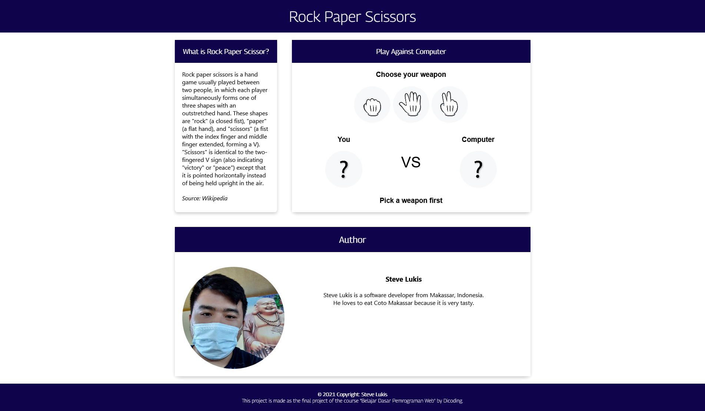
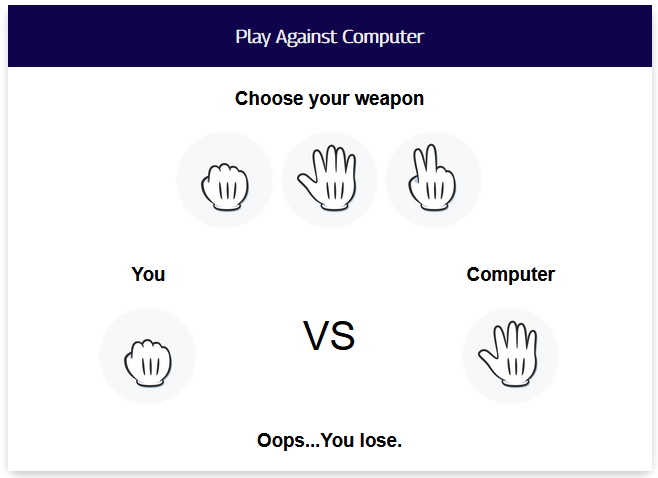

# Rock-Paper-Scissors

This is a static website where a human can play rock-paper-scissors against CPU.
The weapons CPU chooses are totally random (in meaning that it doesn't take the 
human's choice into calculation).

This project is made as my final submission for the course 
"Belajar Dasar Pemrograman Web" by Dicoding.

